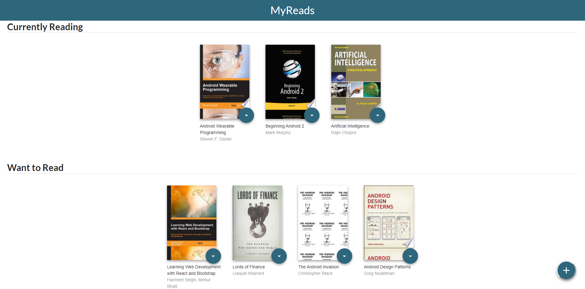

# MyReads

 A bookshelf app written in React that allows you to select and categorize books you have read, are currently reading, or want to read.

## Get started

To get started developing right away:

* install all project dependencies with `npm install`
* start the development server with `npm start`