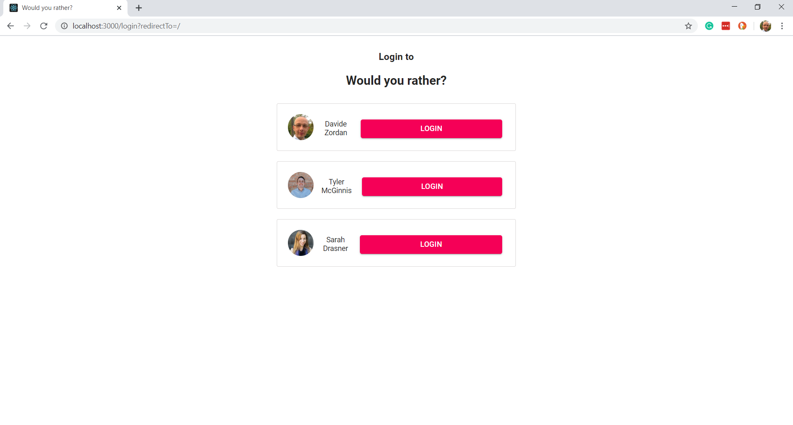
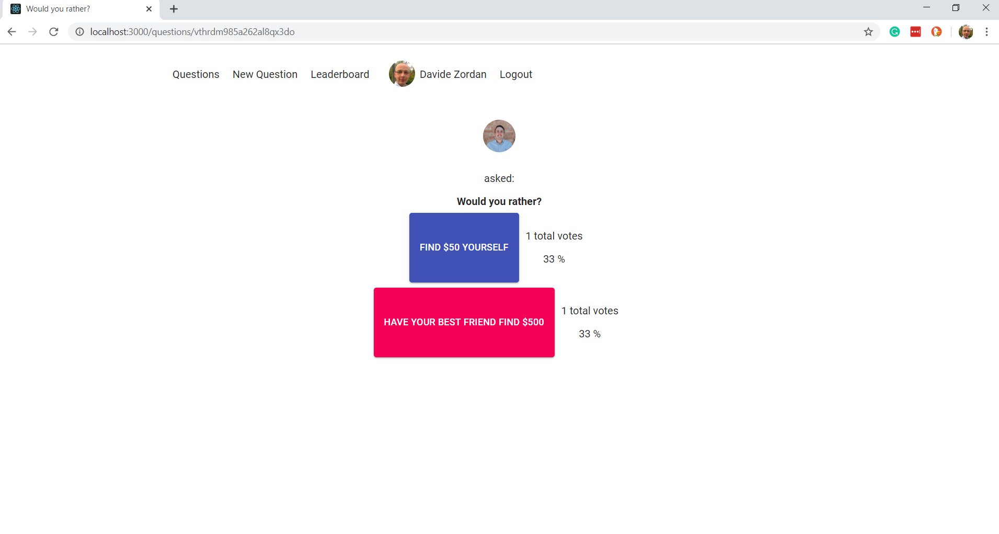
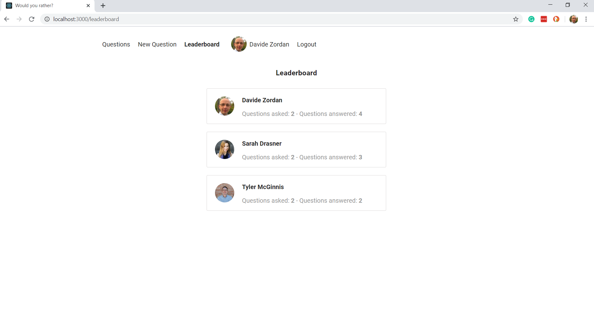
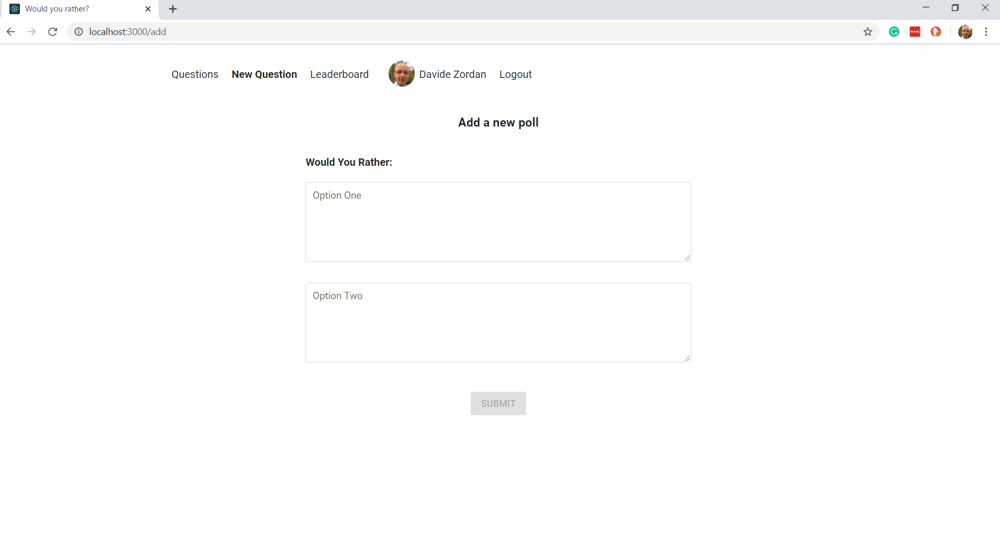

# Would you rather?

A web app that lets a user play the “Would You Rather?” game. The game goes like this: A user is asked a question in the form: “Would you rather [option A] or [option B] ?”. Answering "neither" or "both" is against the rules.

## Get started

To get started developing right away:

* install all project dependencies with `npm install`
* start the development server with `npm start`

## References
- [Starter project](https://github.com/udacity/reactnd-project-would-you-rather-starter)
- [React Redux todo goals app](https://github.com/udacity/reactnd-redux-todos-goals)
- [React Nanodegree twitter app](https://github.com/udacity/reactnd-chirper-app)
